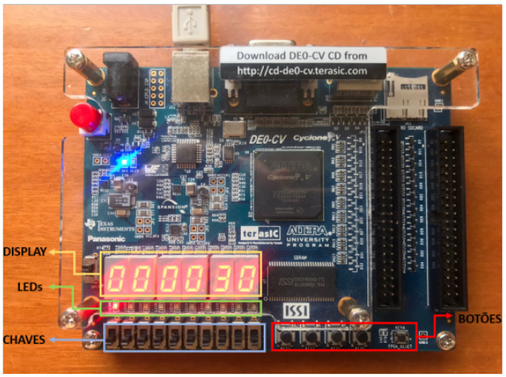
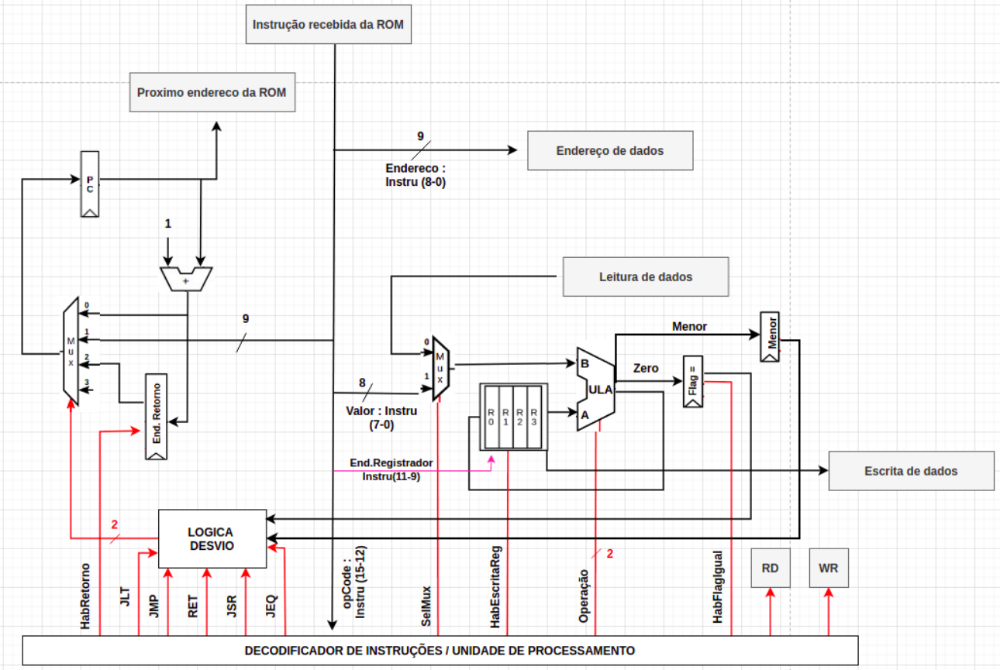
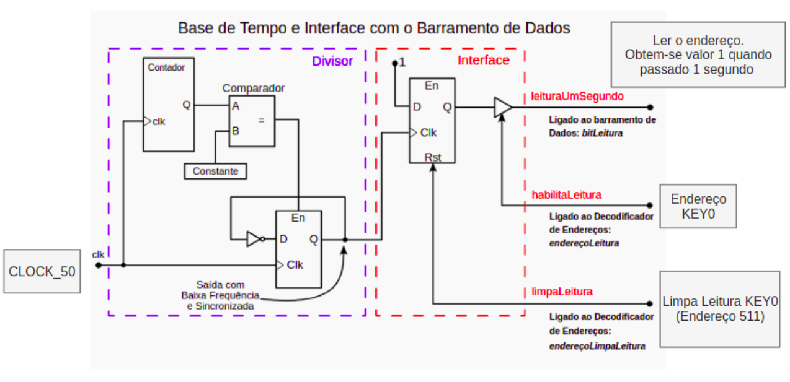
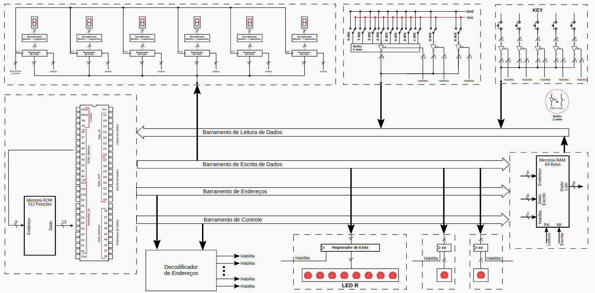
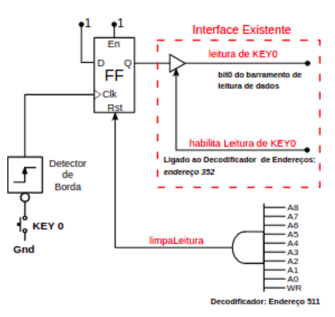

## ⏰️ FPGA-Clock

* Placa utilizada no projeto : [DE0-CV Board](https://www.terasic.com.tw/cgi-bin/page/archive.pl?Language=English&CategoryNo=165&No=921)

* Software utilizado na programação do projeto : [Quartus Prime Lite, versão 20.1](https://www.intel.com/content/www/us/en/collections/products/fpga/software/downloads.html?s=Newest&edition=lite&f:guidetmD240C377263B4C70A4EA0E452D0182CA=%5BIntel%C2%AE%20Quartus%C2%AE%20Prime%20Design%20Software%3BIntel%C2%AE%20Quartus%C2%AE%20Prime%20Lite%20Edition%5D)

  

O objetivo do projeto é a implementação de um processador juntamente com um montador Assembler, que será utilizado em um relógio com as seguintes características :

* Indica horas, minutos e segundos.

* O horário deverá ser mostrado através do display de sete segmentos.
  
* Possui um sistema para acertar o horário.

Para entender mais sobre o projeto, confira o arquivo `Relogio.pdf`.

Clique [aqui](https://youtu.be/K1QLyN4HzFs?si=zYU1Ws6WwycHXnDx) e veja o relógio funcionando! 

### 👩‍💻️ Características do Processador

* Arquitetura Harvard;

* Barramento de dados : 8 bits.

* Barramento de endereços : 16 bits;

* Topologia `Registrador-Memória`.

### 📊️ Diagramas

`Arquitetura do Processador`

  

`Base de Tempo`

  

`Leds e Chaves`

  

`Botão`

  

 
@2023, Insper. Sexto Semestre, Engenharia da Computação.
